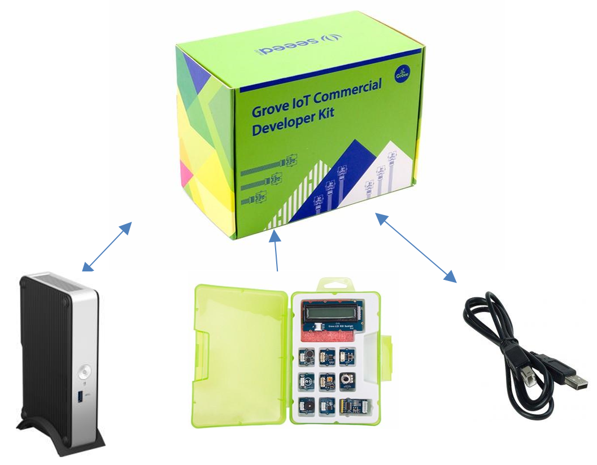
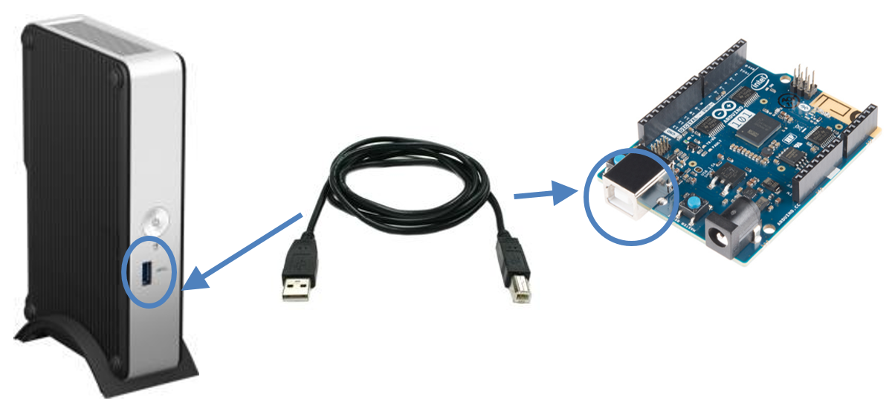
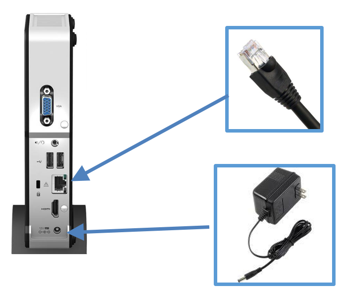
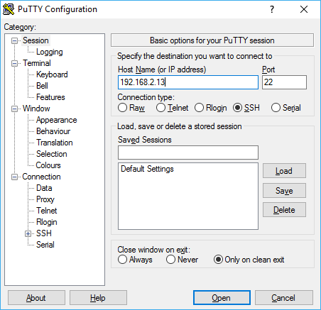
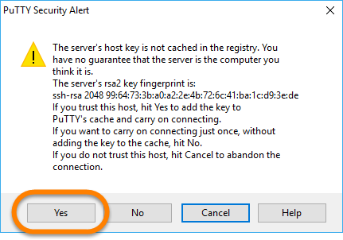
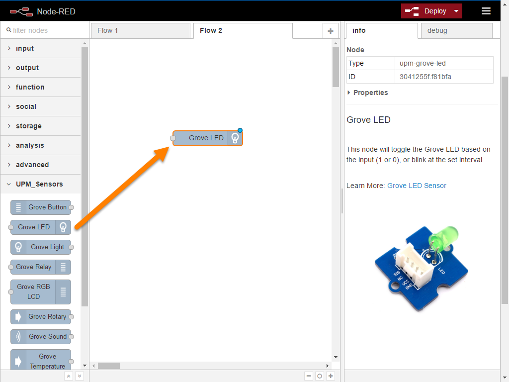
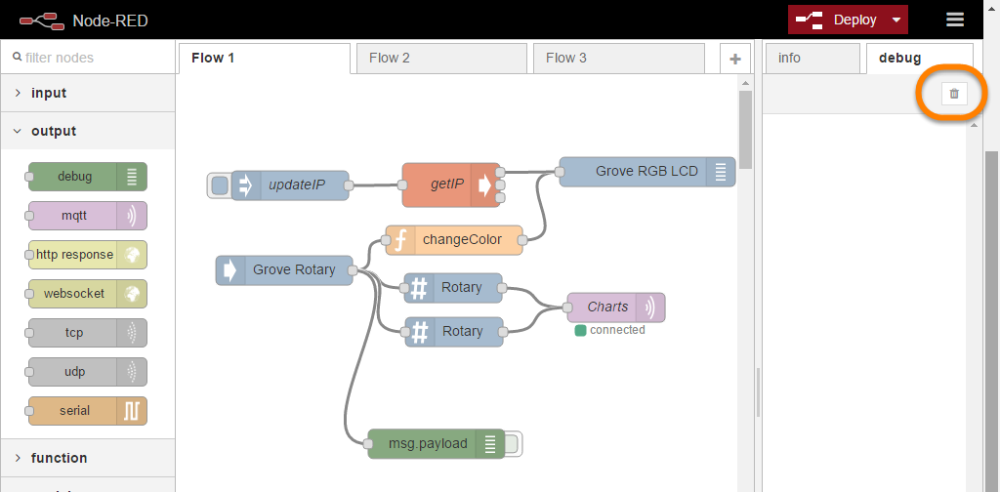

Intel IoT Gateway, Arduino 101 and Microsoft Azure Hands-On-Lab
===

Overview
---

In this lab, we will unbox and set up an Intel IoT Gateway and the Arduino 101 board (with a Grove Starter kit) along with several services available in Microsoft Azure to monitor the temperature and alert maintenance of a high temperature. Using Node-RED, running on the Intel NUC Gateway, the application will read the temperature value from a Grove temperature sensor and publish that data to an Azure IoT Hub.  From there a collection of Azure services including Stream Analytics, Event Hubs, SQL Database, Web Applications and Power BI Embedded will be used to both display the temperature data as well as alert the user to temperature readings over a certain threshold. 


Prerequisites
---

In order to successfully complete this lab you will ned:

- Intel Grove Commercial IoT Developer Kit [link](https://www.seeedstudio.com/Grove-IoT-Commercial-Developer-Kit-p-2665.html)
- Arduino 101 [link](https://www.arduino.cc/en/Main/ArduinoBoard101)
- A computer.  Windows, Mac OSx or Linux
- An active Microsoft Azure Subscription [free trial](https://azure.microsoft.com/en-us/free/)

Tasks
---

1. [Getting Started with Grove IoT Commercial Developer Kit](#GettingStartedWithGrove)
1. [Intel NUC Developer Hub Overview](#IntelNucHubOverview)
1. [Connecting to your Gateway using SSH](#ConnectingWithSSH)
1. [Blinking an LED with Node-RED](#Blinky)
1. [Reading the Temperature Sensor](#ReadingTemperatures)
1. [Creating an Azure IoT Hub and Device](#CreateIoTHubAndDevice)
1. [Publishing Temperature Sensor Data to the Azure IoT Hub](#PublishToIoTHub)
1. [Processing Temperature Data with Stream Analytics](#ProcessingWithStreamAnalytics)
1. [Displaying Temperature Data with Azure Web Apps](#AzureWebApp)
1. [Sending Messages from the Azure IoT Hub to the Intel Gateway](#CloudToDeviceMessages)
1. [TIME PERMITTING - Display Temperature Data with Power BI Embedded](#PowerBIEmbedded)

___

<a name="GettingStartedWithGrove"></a>
Getting Started with Grove IoT Commercial Developer Kit
---


1. Unbox the Grove Starter Kit and Arduino 101

    
    

1. Remove the Grove Base Shield from the Grove Starter Kit and attach it to the Arduino 101

    

1. Ensure the base sheild's voltage selector switch is set to 5V

    

1. Connect the LCD to any I2C socket and rotary angle to A0 socket with a grove connector cable as shown below, the cables are in the green box.

    
    

1. Connect the Arduino 101 to the Intel IoT Gateway using the USB cable provided:

    

1. Connect the Intel IoT Gateway to Ethernet and Power

    

1. Press the power button on the IoT Gateway to boot it.  It will take about two minutes or so for the device to boot.  Once it has booted the default Node-RED flow on the gateway will run and display the Gateway's IP Address on the LCD panel attached to the Arduion 101.  ***The IP Address displayed is the IP Address of your Intel IoT Gateway NUC.  You will use this to attach to your gateway throughout the rest of this lab.***  

    

1. Open your browser and go to the IP Address from the previous step (http://xxx.xxx.xxx.xxx where xxx.xxx.xxx.xxx is the IP Address from above).  If you are presented with a **"Privacy Statement"** click **"Continue"**.

    

1. Login is using the "**root**" as both the user name and password:

    

1. If presented with the "**License Agreement**", click "**Agree**" to continue:

    

1. Once you have successfully logged in, you should see the "**IoT Gateway Developer Hub". 

    
___

<a name="IntelNucHubOverview"></a>
Intel NUC Developer Hub Overview
---

The Developer Hub is a front end interface for the Gateway. It has 5 main functions:

- Display sensor data and basic Gateway information on a configurable dashboard 
- Access the Node-RED development environment 
- Add repositories, install and upgrade packages
- Administer the Gateway – update OS, configure network setting 
- Access documentation 

1. The "**Sensors**" page can be used to monitor the sensor data that is being published to the dashboard.  By default the gateway is configured to display the value of the rotary angle sensor (knob) attached to the Arduino 101.  You can twisth the knob to see the values change in the Device and Sensor Information panel on this page.  

    

1. You can collapse the Device and Sensor Information panel along the top of the page to make the other information below easier to see by clicking the arrow at the top of the navigation bar.  Click the button again to expand the panel again.  

    

1. The "**Packages**" page allows you to manage the various RPM package repositories and installed packages on your gateway.  We will use this page later to add the Microsoft Azure related capabilities to your gateway.

    > **Note**: PLEASE DO NOT INSTALL UPDATES AT THIS TIME.  While normally you would want to update your devices, in the lab environment this will take too long and negatively impact the available network bandwidth.  Please refrain from updating your IoT Gateway while at an IoT Camp event. You are welcome to perform the updates back on your own network. 

      

1. The "Administration" page provides easy access to a number of tools.  The tools most applicable to this lab are the "Quick Tools":

    > **Note**: PLEASE DO NOT INSTALL OS UPDATES OR UPGRADE TO PRO AT THIS TIME.  While these options may be desirable they will take too long for the time frame of this lab as well as have a negative impact on the available bandwidth at the event.  Please refrain from updating your IoT Gateway while at an IoT Camp event.  You are welcome to perform the updates back on your own network. 

    - Easy access to the Node-RED development environment that has been pre-installed on the IoT Gateway.  We will use this extensively in this lab.
    - A way to register your gateway with the "Wind River Helix App Cloud".  We won't be using this feature as part of this lab.
    - Access to the "LuCI" ( [link](https://github.com/openwrt/luci/wiki) ) interface to configure administrative settings on your gateway.  **PLEASE DO NOT MAKE CHANGES USING THIS TOOL.**     
    - The "Cloud Commander" web console, file manager, and editor.

    

1. The "Documentation" page provides a wealth of documentation, community, and source code resources.

      

___

<a name="ConnectingWithSSH"></a>
Connecting to your Gateway using SSH
---

In order to perform advanced configuration of the Gateway either a monitor and keyboard, or a Secure Shell (SSH) connection is required. On OSX and Linux there are default programs that can do this - Screen and SSH respectively. However on Windows no default exists, however Putty is light weight and easy to install and can be used to SSH into the Gateway.


1. For Windows users:

    > **Note**: In the screen shots below, ***192.168.2.13*** is the IP Address of the IoT Gateway being connected to.  Replace that IP Address with the IP Address of your IoT Gateway.  That is the IP Address that should be displayed on the LCD Panel attached to your Arduino 101.

    - Visit the [PuTTY download page](http://www.chiark.greenend.org.uk/~sgtatham/putty/download.html).
    - Under the "For Windows on Intel x86" heading, click on the "putty.exe" link to download the latest release version to your computer. Or if you prefer to use an installer that includes all of the additional tools like PSCP and PSFTP click the putty-0.67-installer.exe link (or latest version).

    

    - Double-click putty.exe on your computer to launch PuTTY, or run the installer to install it if you chose to download it.  Then run PuTTY.
    - Enter IP address of the Gateway

    

    - If you are presented with a "**PuTTY Security Alert**", click "**Yes**" to continue:

    

    - You can login with the username root and the password root.

    

1. For Mac OSx and Linux users

    - Open a terminal Window
    - At the prompt, type the follwing command.  Replace `<<IP Address>>` with the IP Address of your IoT Gateway: 

        `ssh root@<<IP Address>>`

    - Enter ***root*** as the password

___

<a name="Blinky"></a>
Blinking an LED with Node-RED
---

In this exercise, you will use the Node-RED development environment pre-installed on the Intel IoT Gateway to blink the onboard LED on your Arduino 101. 

1. To open the Node-RED development environment on your IoT Gateway:

    - In your browser, navigate to http://xxx.xxx.xxx.xxx where xxx.xxx.xxx.xxx is your gateway's IP Address.
    - Click the "Administration" link
    - Click the "Launch" button under the "Node-RED" icon.

    

    > **Note**: Accessing the Node-RED environment from the Administration page leaves the IoT Gateway links, etc. still visible at the top of the page and can cause some difficulty with the Node-RED environemtn.  If you prefer to access the Node-RED environment directly, you can do so by navigating to port **1880** on your gateway using **http://xxx.xxx.xxx.xxx:1880** . Again, replace xxx.xxx.xxx.xxx with your gateway's IP Address.   

1. The Node-RED environment will show the default "Flow 1" workflow that is responsible for retrieving your gateway's IP Address and displaying it on the LCD panel as well as reading the value from the rotary angle sensor and displaying it in the charts on the IoT Gateway web portal.  Leave this flow as is for now. 

    

1. The Node-RED Environment can be used to create IoT workflows.

    

1. To create a new flow, click the "**+**" button to the right of the "Flow 1" tab along the top of the Visual Editor.  A new flow, named "Flow 2" will open on a new tab.

    

1. From the "**UPM_Sensors**" group in the nodes panel, drag the "Grove LED" node into the visual editor.

    

1. Double-click on the "**Grove LED**" node in the visual editor.  A window will open to allow you to edit the properties of the node:  Set the properties as follows, the click "**OK**" to save the changes.

    - Name: **Blinky**
    - Platform: **Firmata**
    - Pin - **D13**
    - Mode - **Blink**
    - Interval(ms) - **1000**

    

1. Click the "**Deploy**" button in the top right corner of the Node-RED environment to deploy the new flow. 

    

1. Once the flow has been deployed, the LED onboard the Arduino 101 will start blinking on and off in one second (1000ms) intervals.

    > **Note**: With the Grove Base Shield attached to the Arduino, the LED will be difficult to see.  You will need to peek under the shield to see the LED on the Arduino 101 blinking on and off. 

    

1. In the Node-RED Visual Editor you can also see the "Blinky" node's status change with the "**OFF**" and "**ON**" indicator below it:

    

___

<a name="ReadingTemperatures"></a>
Reading the Temperature Sensor
---

Now that you have a basic understanding of how to interact with the Gateway. Let’s move on to adding some more sensor data and processing to the gateway. 
We will create Node-red flow to get data from temperature sensor and display it on debug window. We will be extending this flow to send data to Azure IoT hub later. 

1. Attach the **Grove Temperature Sensor** to the **Grove Base Shield** port **A1**
 using one of the supplied cables.

        

1. In the Node-RED environment, create a new flow named "Flow 3" 

    

1. From the "**UPM_Sensors**" group in the nodes, panel, drag a "**Grove Temperature Sensor**" into the visual editor for "**Flow 3**". Then double click on the new node, and set the properties as follows.  Click the "**OK**" button to save the changes:

    - Name - **Leave Blank**
    - Platform - **Firmata**
    - Pin - **A1**
    - Unit - **Celsius**
    - Interval (ms) - **1000**

    

1. From the "**function**" group add a "**function**" node to "**Flow 3**" and connect it to the existing "**Temperature**" node as shown below.  Double click on the new "**function**" node and complete the properites as follows.  Click the "**OK**" button to save the changes:

    > **Note**: The purpose of this function is to provide the correct temperature when the sensor is being read with a 5V source. The sensor functions at 3.3 by default.

    - Name - **Data Conversion**
    - Function - **Use the following code**

        ````javascript
        msg.payload = msg.payload * 3.3 / 5
        return msg;
        ````

    - Outputs - **1**

    

1. Connect the existing "**Temperature**" node to the new "**Data Conversion**" function node by dragging a line from the square box at on the right end of the "**Temperature**" node to the squre box on the left edge of the "**Data Conversion**" node. 

    

1. Add the following nodes, configure them as follows, and connect them as shown below:

    > **Note**: The "**Create Payload**" function creates the data payload that will eventually be sent up to the Azure IoT Hub.  

    - From the "**function**" group, another "**function**" node.
        - Name - "**Create Payload**"
        - Function - **Use the following code**

            ````javascript
            var gateway = "IntelIoTGateway";
            return {
                payload: {
                    deviceID: gateway,
                    temp: msg.payload
                }
            };
            ````
        - Outputs **1**
    - From the "**function**" group, add a "**json**" node.  No configuration is necessary.
    - From the "**output**" group, add a "**debug**" node.  No configuration is necessary.

    

1. Before we test the new flow, we want to turn off any debug messages being generated by the default flow on the "**Flow 1**" tab. 
    - In the Node-RED editor, switch to the "**Flow 1**" tab.
    - On the right hand side, click on the "**debug**" tab to view debug messages.
    - You may or may not see debug messages showing the current value of the rotary angle sensor
    - Regardless, on the "**msg.payload**" debug node, click the box on the right edge of the node to disable the debug messages. The box on the right edge of a debug node has two possible states.  Make sure the debug node has it's debug messages **disabled**:
        - Debug messages are enabled, and will appear on the "**debug**" tab:

        

        - Debug messages are disabled, and no messages will appear on the "**debug**" tab. 

        

    

1. Next, click the trashcan icon on the debug tab to delete any debug messages currently being displayed on the tab:

    

1. Finally, we can test the new flow.  
    - Switch to the "**Flow 3**" tab
    - Click the "**Deploy**" button
    - Once you have deployed "**Flow 3**" ensure that it's "**msg.payload*"" debug has it's debug messages enabled
    - Watch for the debug messages to appear on the "**debug**" tab.

    > **Note**: If you can't see the entire debug message on the debug tab, you can drag the splitter bar between the "**Visual Editor**" and "**debug**" tab panels to expand the view, or you can scroll to the right on the "**debug**" tab using the horizontal scroll bar at the bottom of it.

    > **Note**: You can touch the temperature sensor (or blow on it) to see the value of the "**temp**" displayed change on the "**debug**" tab.   

    

___

<a name="CreateIoTHubAndDevice"></a>
Creating an Azure IoT Hub and Device
---

1. Do this

    ````javascript
     var sample = 'with some code';
     console.log(sample);
    ````

1. Show some screenshot:

    

1. Do something else

    > **Note!**: This is a sample note!

    - With one
    - or two
    - substeps

___

<a name="PublishToIoTHub"></a>
Publishing Temperature Sensor Data to the Azure IoT Hub
---

1. Do this

    ````javascript
     var sample = 'with some code';
     console.log(sample);
    ````

1. Show some screenshot:

    

1. Do something else

    > **Note!**: This is a sample note!

    - With one
    - or two
    - substeps

___

<a name="ProcessingWithStreamAnalytics"></a>
Processing Temperature Data with Stream Analytics
---

1. Do this

    ````javascript
     var sample = 'with some code';
     console.log(sample);
    ````

1. Show some screenshot:

    

1. Do something else

    > **Note!**: This is a sample note!

    - With one
    - or two
    - substeps

___

<a name="AzureWebApp"></a>
Displaying Temperature Data with Azure Web Apps
---

1. Do this

    ````javascript
     var sample = 'with some code';
     console.log(sample);
    ````

1. Show some screenshot:

    

1. Do something else

    > **Note!**: This is a sample note!

    - With one
    - or two
    - substeps

___

<a name="CloudToDeviceMessages"></a>
Sending Messages from the Azure IoT Hub to the Intel Gateway
---

1. Do this

    ````javascript
     var sample = 'with some code';
     console.log(sample);
    ````

1. Show some screenshot:

    

1. Do something else

    > **Note!**: This is a sample note!

    - With one
    - or two
    - substeps

___

<a name="PowerBIEmbedded"></a>
TIME PERMITTING - Display Temperature Data with Power BI Embedded
---

1. Do this

    ````javascript
     var sample = 'with some code';
     console.log(sample);
    ````

1. Show some screenshot:

    

1. Do something else

    > **Note!**: This is a sample note!

    - With one
    - or two
    - substeps


