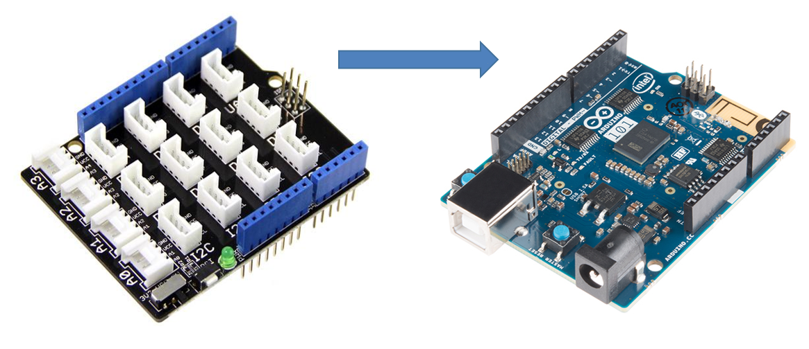
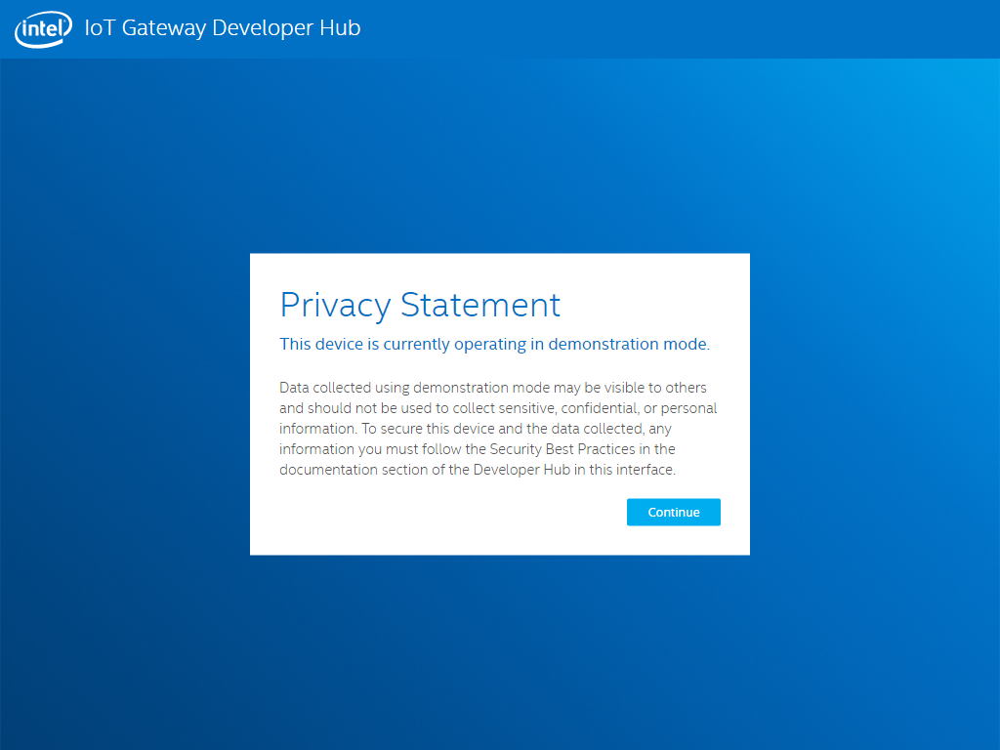
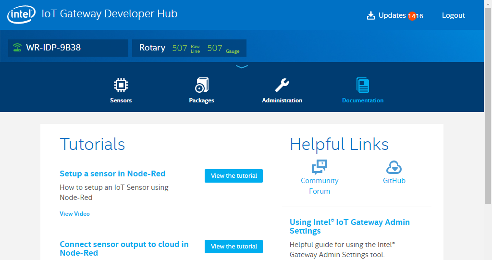
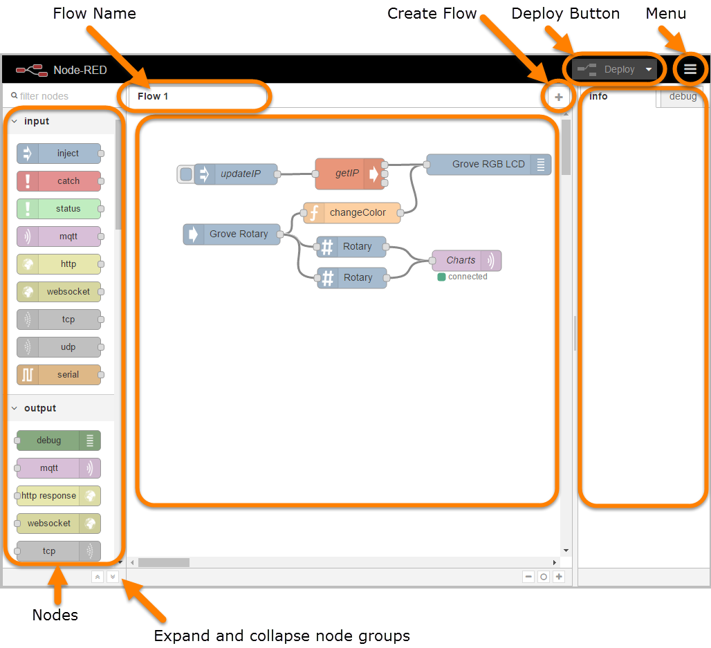
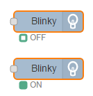
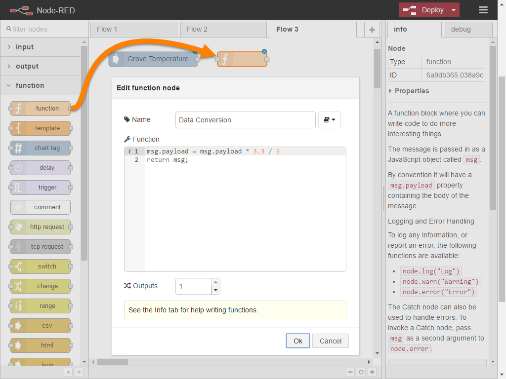
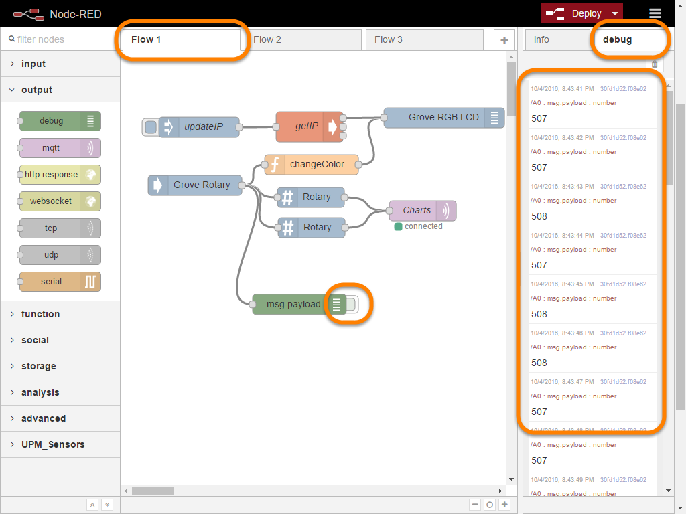
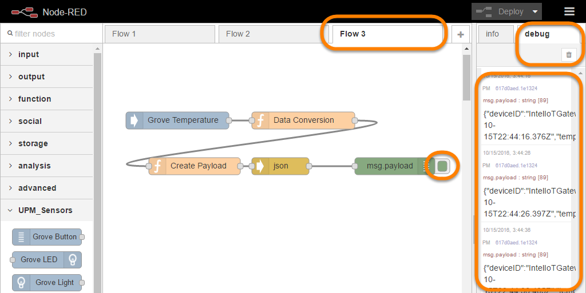
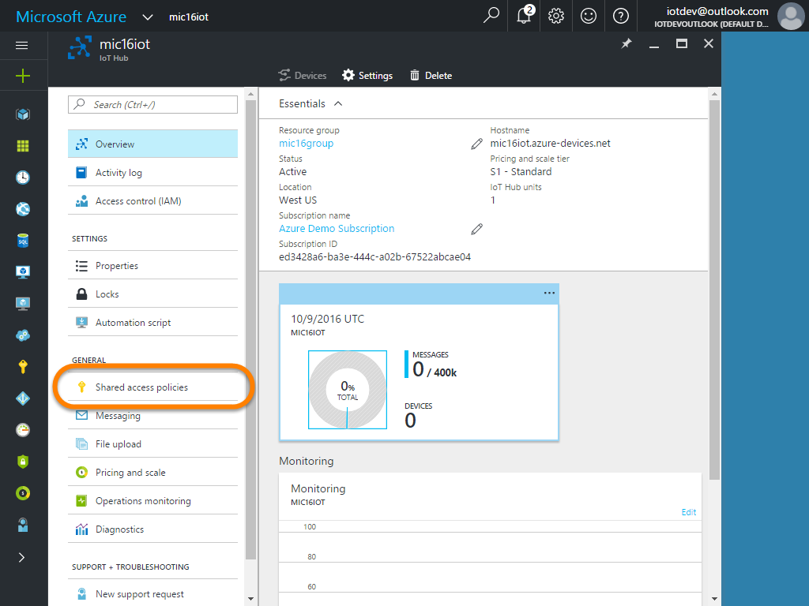
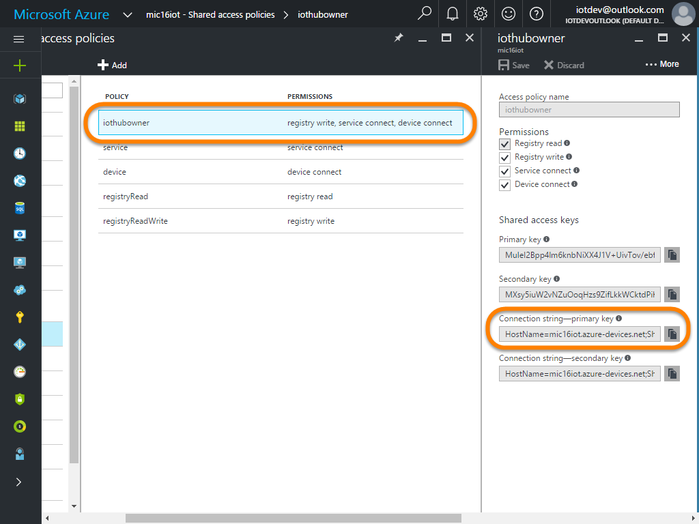

Intel IoT Gateway, Arduino 101 and Microsoft Azure Hands-On-Lab
===

Overview
---

In this lab, we will unbox and set up an Intel IoT Gateway and the Arduino 101 board (with a Grove Starter kit) along with several services available in Microsoft Azure to monitor the temperature and alert maintenance of a high temperature. Using Node-RED, running on the Intel NUC Gateway, the application will read the temperature value from a Grove temperature sensor and publish that data to an Azure IoT Hub.  From there a collection of Azure services including Stream Analytics, Event Hubs, SQL Database, Web Applications and Power BI Embedded will be used to both display the temperature data as well as alert the user to temperature readings over a certain threshold.

 


Prerequisites
---

In order to successfully complete this lab you will ned:

- Intel Grove Commercial IoT Developer Kit [link](https://www.seeedstudio.com/Grove-IoT-Commercial-Developer-Kit-p-2665.html)
- Arduino 101 [link](https://www.arduino.cc/en/Main/ArduinoBoard101)
- A computer.  Windows, Mac OSx or Linux
- An active Microsoft Azure Subscription.  If you do not have a current subscription, you can create one using the [free trial](https://azure.microsoft.com/en-us/free/)
- Node.js 4.x or later.  You can install Node.js from **[https://nodejs.org/en/](https://nodejs.org/en/)**
- Visual Studio Code. Visual Studio Code is a free, open source, cross platform development environment.  You can install it from **[http://code.visualstudio.com](http://code.visualstudio.com)**

Tasks
---

1. [Getting Started with Grove IoT Commercial Developer Kit](#GettingStartedWithGrove)
1. [Intel NUC Developer Hub Overview](#IntelNucHubOverview)
1. [Connecting to your Gateway using SSH](#ConnectingWithSSH)
1. [Blinking an LED with Node-RED](#Blinky)
1. [Reading the Temperature Sensor](#ReadingTemperatures)
1. [Planning your Azure Resources](#PlanningAzure)
1. [Creating an Azure IoT Hub](#CreateIoTHub)
1. [Creating an Azure IoT Hub Device Identity](#CreateIoTHubDeviceIdentity)
1. [Publishing Temperature Sensor Data to the Azure IoT Hub](#PublishToIoTHub)
1. [Processing Temperature Data with Stream Analytics](#ProcessingWithStreamAnalytics)
1. [Displaying Temperature Data with Azure Web Apps](#AzureWebApp)
1. [Sending Messages from the Azure IoT Hub to the Intel Gateway](#CloudToDeviceMessages)
1. [TIME PERMITTING - Display Temperature Data with Power BI Embedded](#PowerBIEmbedded)

___

<a name="GettingStartedWithGrove"></a>
Getting Started with Grove IoT Commercial Developer Kit
---


1. Unbox the Grove Starter Kit and Arduino 101

    
    

1. Remove the Grove Base Shield from the Grove Starter Kit and attach it to the Arduino 101

    

1. Ensure the base sheild's voltage selector switch is set to 5V

    

1. Connect the LCD to any I2C socket and rotary angle to A0 socket with a grove connector cable as shown below, the cables are in the green box.

    
    

1. Connect the Arduino 101 to the Intel IoT Gateway using the USB cable provided:

    

1. Connect the Intel IoT Gateway to Ethernet and Power

    

1. Press the power button on the IoT Gateway to boot it.  It will take about two minutes or so for the device to boot.  Once it has booted the default Node-RED flow on the gateway will run and display the Gateway's IP Address on the LCD panel attached to the Arduion 101.  ***The IP Address displayed is the IP Address of your Intel IoT Gateway NUC.  You will use this to attach to your gateway throughout the rest of this lab.***  

    

1. Open your browser and go to the IP Address from the previous step (http://xxx.xxx.xxx.xxx where xxx.xxx.xxx.xxx is the IP Address from above).  If you are presented with a **"Privacy Statement"** click **"Continue"**.

    

1. Login is using the "**root**" as both the user name and password:

    

1. If presented with the "**License Agreement**", click "**Agree**" to continue:

    

1. Once you have successfully logged in, you should see the "**IoT Gateway Developer Hub". 

    
___

<a name="IntelNucHubOverview"></a>
Intel NUC Developer Hub Overview
---

The Developer Hub is a front end interface for the Gateway. It has 5 main functions:

- Display sensor data and basic Gateway information on a configurable dashboard 
- Access the Node-RED development environment 
- Add repositories, install and upgrade packages
- Administer the Gateway – update OS, configure network setting 
- Access documentation 

1. The "**Sensors**" page can be used to monitor the sensor data that is being published to the dashboard.  By default the gateway is configured to display the value of the rotary angle sensor (knob) attached to the Arduino 101.  You can twisth the knob to see the values change in the Device and Sensor Information panel on this page.  

    

1. You can collapse the Device and Sensor Information panel along the top of the page to make the other information below easier to see by clicking the arrow at the top of the navigation bar.  Click the button again to expand the panel again.  

    

1. The "**Packages**" page allows you to manage the various RPM package repositories and installed packages on your gateway.  We will use this page later to add the Microsoft Azure related capabilities to your gateway.

    > **Note**: PLEASE DO NOT INSTALL UPDATES AT THIS TIME.  While normally you would want to update your devices, in the lab environment this will take too long and negatively impact the available network bandwidth.  Please refrain from updating your IoT Gateway while at an IoT Camp event. You are welcome to perform the updates back on your own network. 

      

1. The "Administration" page provides easy access to a number of tools.  The tools most applicable to this lab are the "Quick Tools":

    > **Note**: PLEASE DO NOT INSTALL OS UPDATES OR UPGRADE TO PRO AT THIS TIME.  While these options may be desirable they will take too long for the time frame of this lab as well as have a negative impact on the available bandwidth at the event.  Please refrain from updating your IoT Gateway while at an IoT Camp event.  You are welcome to perform the updates back on your own network. 

    - Easy access to the Node-RED development environment that has been pre-installed on the IoT Gateway.  We will use this extensively in this lab.
    - A way to register your gateway with the "Wind River Helix App Cloud".  We won't be using this feature as part of this lab.
    - Access to the "LuCI" ( [link](https://github.com/openwrt/luci/wiki) ) interface to configure administrative settings on your gateway.  **PLEASE DO NOT MAKE CHANGES USING THIS TOOL.**     
    - The "Cloud Commander" web console, file manager, and editor.

    

1. The "Documentation" page provides a wealth of documentation, community, and source code resources.

      

___

<a name="ConnectingWithSSH"></a>
Connecting to your Gateway using SSH
---

In order to perform advanced configuration of the Gateway either a monitor and keyboard, or a Secure Shell (SSH) connection is required. On OSX and Linux there are default programs that can do this - Screen and SSH respectively. However on Windows no default exists, however Putty is light weight and easy to install and can be used to SSH into the Gateway.


1. For Windows users:

    > **Note**: In the screen shots below, ***192.168.2.13*** is the IP Address of the IoT Gateway being connected to.  Replace that IP Address with the IP Address of your IoT Gateway.  That is the IP Address that should be displayed on the LCD Panel attached to your Arduino 101.

    - Visit the [PuTTY download page](http://www.chiark.greenend.org.uk/~sgtatham/putty/download.html).
    - Under the "For Windows on Intel x86" heading, click on the "putty.exe" link to download the latest release version to your computer. Or if you prefer to use an installer that includes all of the additional tools like PSCP and PSFTP click the putty-0.67-installer.exe link (or latest version).

    

    - Double-click putty.exe on your computer to launch PuTTY, or run the installer to install it if you chose to download it.  Then run PuTTY.
    - Enter IP address of the Gateway

    

    - If you are presented with a "**PuTTY Security Alert**", click "**Yes**" to continue:

    

    - You can login with the username root and the password root.

    

1. For Mac OSx and Linux users

    - Open a terminal Window
    - At the prompt, type the follwing command.  Replace `<<IP Address>>` with the IP Address of your IoT Gateway: 

        `ssh root@<<IP Address>>`

    - Enter ***root*** as the password

___

<a name="Blinky"></a>
Blinking an LED with Node-RED
---

In this exercise, you will use the Node-RED development environment pre-installed on the Intel IoT Gateway to blink the onboard LED on your Arduino 101. 

1. To open the Node-RED development environment on your IoT Gateway:

    - In your browser, navigate to http://xxx.xxx.xxx.xxx where xxx.xxx.xxx.xxx is your gateway's IP Address.
    - Click the "Administration" link
    - Click the "Launch" button under the "Node-RED" icon.

    

    > **Note**: Accessing the Node-RED environment from the Administration page leaves the IoT Gateway links, etc. still visible at the top of the page and can cause some difficulty with the Node-RED environemtn.  If you prefer to access the Node-RED environment directly, you can do so by navigating to port **1880** on your gateway using **http://xxx.xxx.xxx.xxx:1880** . Again, replace xxx.xxx.xxx.xxx with your gateway's IP Address.   

1. The Node-RED environment will show the default "Flow 1" workflow that is responsible for retrieving your gateway's IP Address and displaying it on the LCD panel as well as reading the value from the rotary angle sensor and displaying it in the charts on the IoT Gateway web portal.  Leave this flow as is for now. 

    

1. The Node-RED Environment can be used to create IoT workflows.

    

1. To create a new flow, click the "**+**" button to the right of the "Flow 1" tab along the top of the Visual Editor.  A new flow, named "Flow 2" will open on a new tab.

    

1. From the "**UPM_Sensors**" group in the nodes panel, drag the "Grove LED" node into the visual editor.

    

1. Double-click on the "**Grove LED**" node in the visual editor.  A window will open to allow you to edit the properties of the node:  Set the properties as follows, the click "**OK**" to save the changes.

    - Name: **Blinky**
    - Platform: **Firmata**
    - Pin - **D13**
    - Mode - **Blink**
    - Interval(ms) - **1000**

    

1. Click the "**Deploy**" button in the top right corner of the Node-RED environment to deploy the new flow. 

    

1. Once the flow has been deployed, the LED onboard the Arduino 101 will start blinking on and off in one second (1000ms) intervals.

    > **Note**: With the Grove Base Shield attached to the Arduino, the LED will be difficult to see.  You will need to peek under the shield to see the LED on the Arduino 101 blinking on and off. 

    

1. In the Node-RED Visual Editor you can also see the "Blinky" node's status change with the "**OFF**" and "**ON**" indicator below it:

    

___

<a name="ReadingTemperatures"></a>
Reading the Temperature Sensor
---

Now that you have a basic understanding of how to interact with the Gateway. Let’s move on to adding some more sensor data and processing to the gateway. 
We will create Node-red flow to get data from temperature sensor and display it on debug window. We will be extending this flow to send data to Azure IoT hub later. 

1. Attach the **Grove Temperature Sensor** to the **Grove Base Shield** port **A1**
 using one of the supplied cables.

        

1. In the Node-RED environment, create a new flow named "Flow 3" 

    

1. From the "**UPM_Sensors**" group in the nodes, panel, drag a "**Grove Temperature Sensor**" into the visual editor for "**Flow 3**". Then double click on the new node, and set the properties as follows.  Click the "**OK**" button to save the changes:

    - Name - **Leave Blank**
    - Platform - **Firmata**
    - Pin - **A1**
    - Unit - **Celsius**
    - Interval (ms) - **1000**

    

1. From the "**function**" group add a "**function**" node to "**Flow 3**" and connect it to the existing "**Temperature**" node as shown below.  Double click on the new "**function**" node and complete the properites as follows.  Click the "**OK**" button to save the changes:

    > **Note**: The purpose of this function is to provide the correct temperature when the sensor is being read with a 5V source. The sensor functions at 3.3 by default.

    - Name - **Data Conversion**
    - Function - **Use the following code**

        ````javascript
        msg.payload = msg.payload * 3.3 / 5
        return msg;
        ````

    - Outputs - **1**

    

1. Connect the existing "**Temperature**" node to the new "**Data Conversion**" function node by dragging a line from the square box at on the right end of the "**Temperature**" node to the squre box on the left edge of the "**Data Conversion**" node. 

    

1. Add the following nodes, configure them as follows, and connect them as shown below:

    > **Note**: The "**Create Payload**" function creates the data payload that will eventually be sent up to the Azure IoT Hub.  

    - From the "**function**" group, another "**function**" node.
        - Name - "**Create Payload**"
        - Function - **Use the following code**

            ````javascript
            var gateway = "IntelIoTGateway";
            return {
                payload: {
                    deviceID: gateway,
                    temp: msg.payload
                }
            };
            ````
        - Outputs **1**
    - From the "**function**" group, add a "**json**" node.  No configuration is necessary.
    - From the "**output**" group, add a "**debug**" node.  No configuration is necessary.

    

1. Before we test the new flow, we want to turn off any debug messages being generated by the default flow on the "**Flow 1**" tab. 
    - In the Node-RED editor, switch to the "**Flow 1**" tab.
    - On the right hand side, click on the "**debug**" tab to view debug messages.
    - You may or may not see debug messages showing the current value of the rotary angle sensor
    - Regardless, on the "**msg.payload**" debug node, click the box on the right edge of the node to disable the debug messages. The box on the right edge of a debug node has two possible states.  Make sure the debug node has it's debug messages **disabled**:
        - Debug messages are enabled, and will appear on the "**debug**" tab:

        

        - Debug messages are disabled, and no messages will appear on the "**debug**" tab. 

        

    

1. Next, click the trashcan icon on the debug tab to delete any debug messages currently being displayed on the tab:

    

1. Finally, we can test the new flow.  
    - Switch back to the "**Flow 3**" tab
    - Click the "**Deploy**" button
    - Once you have deployed "**Flow 3**" ensure that it's "**msg.payload*"" debug has it's debug messages enabled
    - Watch for the debug messages to appear on the "**debug**" tab.

    > **Note**: If you can't see the entire debug message on the debug tab, you can drag the splitter bar between the "**Visual Editor**" and "**debug**" tab panels to expand the view, or you can scroll to the right on the "**debug**" tab using the horizontal scroll bar at the bottom of it.

    > **Note**: You can touch the temperature sensor (or blow on it) to see the value of the "**temp**" displayed change on the "**debug**" tab.   

    

___

<a name="PlanningAzure"></a>
Planning your Azure Resources
---

[Microsoft Azure](http://azure.com) provides an incredibly powerful and flexible backend for your IoT solutions.  In this lab, we will configure a robust collection of services to mimic the real world solutions you may implement your self.  With the number of services we will configure, it is helpful to first understand what those services are, and to gather the configuration details we will need for them in advance.  Having done so, the configuraiton of the services themselves will be much easier.  By being consitent on how we organize our resources as well as where we deploy them and how we name them, our job of working with them and managing them is made much simpler.

The following diagram provides an overview of the architecture we will be implementing:

 

### Common Resource Group ###

We will be placing all of the azure resources we provision in this lab into a single "**Resource Group**" ([link](https://azure.microsoft.com/en-us/documentation/articles/resource-group-overview/#resource-groups)).  Resource groups are a core concept in the "**Azure Resource Manager**" ([link](https://azure.microsoft.com/en-us/documentation/articles/resource-group-overview/#resource-groups)) technology used by the Azure platform.  Resource Groups allow you to keep all the resources related to a solution in a single container.  This in invaluable when securing, deploying, and removing the resources.    


### Common Location or "Region" ###

We want to make sure to deploy all of the resources in the same Azure data center, or "**Region**" ([link](https://azure.microsoft.com/en-us/regions/)). This will help to ensure that the resources have low latency connections to each other (for example, the web application can directly access the sql database in the same datacenter), as well as keep our costs low by reducing the amount of data leaving a the data center and incurrent data egress charges.  

That means that when need to select a region that supports all of the services we will use in our solution.  You can review the list of [Products available by region](https://azure.microsoft.com/en-us/regions/services/) to verify that the services required by this lab are available in the region you want to use. The services used in this lab inclue:

- Azure IoT Hubs
- Azure Stream Analytics
- Azure Event Hubs
- Azure Storage
- Azure SQL Database
- Azure Web Apps
- Azure Function Apps
- Azure PowerBI Embedded 

<a name="locations"></a>
At the time this is being written (October 2016), the following regions have all of the required services. **THIS LIST WILL GROW OVER TIME**. You are welcome to review the [Products available by region](https://azure.microsoft.com/en-us/regions/services/) to see if any additional regions provide the resources needed.  Otherwise, simply pick the region from the list below that is closest to you, and ensure that you choose that region for each resource you deploy.   

- West US 
- North Europe 
- West Europe 
- Southeast Asia 
- Australia Southeast  

### Common Naming Convention ###

We will be provisioning a number of resources in this lab.  Some of these resources require globally unique names.  In addition, we need to be able to refere to those resources in the lab documentation.  To facilitate that, it is ***strongly recommended*** that you juse the naming convention outlined here.  In the architecture diagram above, you will see that resources have been named with a ***`<name>`*** prefix, and them some resource specific name.  

Choose a ***`<name>`*** prefix that is unique to you.  It is recommended that you use something like your initials.  For example if your name where "**Jane Q. Doe"** you might select "**jqd**" as your name prefix. To add a little more uniqueness you could add in your two digit birth month.  For example, if Jane was born in "**October**" she might use "**jqd10**".   

For the purposes of this lab, I'll use the "**mic16**" prefix, short for "**Microsoft Intel Camp 2016**".  

**DO NOT USE THE _"mic16"_ PREFIX FOR YOUR OWN RESOURCES**.  

### Service Descriptions ###

| Service | Name | Description | 
| ------- | ---- | ----------- |
| The Device | Intel NUC, Arduino 101 & Grove Sensors  | The Intel NUC is our "Device".  It get's sensor values from the Arduino 101 and Grove sensors that are attached.  We use an easy graphical development environment called "Node-RED" on the NUC to help the NUC send messages with sensor data to the cloud, as well as to receive messags from the cloud and act on them.  |
| Resource Group | ***&lt;name&gt;group*** | Azure Resource Groups provide a convenient way to organize all of the Azure resources for a solution into a single container.  The Resource Group can then be a unit of deployment, a securable collection, and an easy way to delete all of the resources in the group in a single operation.  We want to make sure that all of the resources we create in this lab are placed in the ***&lt;name&gt;group*** resource group.|   
|  IoT Hub | ***&lt;name&gt;iot*** | Provides a way for devices (like the Intel NUC with Arduino 101 in our lab) to send and receive messages in the cloud.  Backend services can read those messages sent by our devices, act on them, and send messages back to the device as needed. |
| IoT Hub Device Identity | ***&lt;name&gt;IntelIoTGateway*** | This is the id we will use for our device's identity in the Azure IoT Hub Device Identiy Registry.   |
|  Stream Analytics Job | ***&lt;name&gt;job*** | The Azure Stream Analytics Job provides a way to watch messages coming into the Azure IoT Hub from our devices and act on them.  In our case it will forward all messages off to a SQL Database so we can report on them, but it will also watch the temperature sensor values in those messages, and forward them to an Event Hub if they exceed a pre-defined threshold temperature. |
| SQL Server |  ***&lt;name&gt;sql*** | The Azure SQL Server instance that will host our Azure SQL Database. Other than creating it to host our database.  This is also where the administrative login for our SQL Server is defined.  It is recommended that you use these login credentials:<br/><br/>login:***sqladmin***<br/>password: ***P@ssw0rd***  |
| SQL Database |  ***&lt;name&gt;db*** | This will store the **dbo.Measurements** table.  The Stream Analytics Job above will forward all temperature messages sent to the IoT Hub into this table so we can report on the temperature data. |
| Event Hub Namespace |  ***&lt;name&gt;ns*** | This is the Service Bus Namespace that hosts our Event Hub.  We really won't do much with this directly, we just need one to host our Event Hub for us.   |
| Event Hub | ***&lt;name&gt;alerts*** | The Event Hub is an internal messaging queue that we will use to pass along temperature alert messages.  The Stream Analytics Job will watch for temperature messages with sensor values that exceed a predefined temperature threshold and forward them off to this event hub.  We'll then create an Azure Function to read the messages out of this event hub and send alerts back to the device.  |
| Storage Account |  ***&lt;name&gt;storage*** | A few of the services require a storage account for their own purposes.  This account exists purely as a resource for those services.  We won't use it directly for our own purposes. |
| App Service Plan |  ***&lt;name&gt;plan*** | The App Service plan provides the execution environment (servers) for our Web App and Function App.  We can scale our App Service Plan up or down as needed to get give those services the performance they require.  |
| Web App |  ***&lt;name&gt;web*** | The Azure Web App is where we will deploy our Node.js application that provides the web site for our solution.  We can then go to this site to view temperatures from our devices |
| Function App |  ***&lt;name&gt;functions*** | The Azure Function App contains the ***TempAlert*** function. |
| Function |  ***TempAlert*** | The ***TempAlert*** function will be triggered automatically whenever a new message is sent to our ***&lt;name&gt;alerts*** event hub. It will then read those messages, retrieve the id of the device it was sent from, and then send a message through the IoT Hub back to that device to let it know that it's temperature has exceeded acceptible levels.  The device can then sound an alarm by turning on it's buzzer. |
| Power BI Embedded Workspace Collection |  ***&lt;name&gt;collection*** | Power BI Embedded Collections are what you configure in Azure to host one or more Power BI Embedded Workspaces. | 
| Power BI Embedded Workspace |  ***system generated guid*** | The Power BI Embedded Workspace is where we can upload one or more reports. |
| Power BI Embedded Report |  ***TemperatureChart*** | The ***TemperatureChart*** report is a pre-built report that displays device and temperature data from the ***&lt;name&gt;db*** Azure SQL Database.  It is provided as the ***TemperatureChart.pbix*** Power BI Desktop file in the lab files.  We'll upload this report into our Power BI Embedded Workspace and then embed it in the UI of our Web Application.  Users viewing the web application in their browser can then see that report. |

### Documenting Your Choices ###

In the same folder as this readme file where you extract the lab files for this lab there is a "**[myresources.txt](myresources.txt)**" text file.  You can open that file in the text editor of your choice, and record the choices you make here for your ***&lt;name&gt;*** name prefix and for the region you wish to use.


___

<a name="CreateIoTHub"></a>
Creating an Azure IoT Hub
---

In this task, we'll create the ***&lt;name&gt;*** iot Azure IoT Hub and since it's our first Azure resource, we'll create the ***&lt;name&gt;group*** resource group to put it in.  Make sure that you understand the information in the [Planning your Azure Resources](#PlanningAzure) section before continuing.

1. Open the [Azure Portal](https://portal.azure.com) ([https://portal.azure.com](https://portal.azure.com)) and login to your subscription.  If you don't have a current Azure Subscription you can create a [free trial](https://azure.microsoft.com/en-us/free/).

1. Click the "**+ New**" button, then select "**Internet of Things**", and select "**Iot Hub**"

    

1. Complete the properties for the new IoT Hub as shown below, the click the "**Create**" button to provision the new IoT Hub in the new Resource Group:
    - Name: ***&lt;name&gt;iot*** - Use the naming prefix you selected in the [Planning your Azure Resources](#PlanningAzure) section.
    - Pricing and scale tier: **S1 - Standard**  (There is a free tier, but we will be removing these resources at the end of the lab, and the S1 pricing teir should not impact your subscription significantly)
    - IoT Hub units: **1**
    - Device-to-cloud partitions: **4**
    - Subscription: **choose the subscription you wish to use if you have multiple available**
    - Resource Group: **Create new** resource group using the ***&lt;name&gt;group*** naming convention
    - Enable Device Management - PREVIEW: **Leave Unchecked**
    - Location: **Choose the location [listed above](#locations) that is closest to you, and then make sure to use that location for all other resources in the lab**
    - Pin to dashboard: **Checked** (this will place a tile for the IoT Hub on your portal dashboard.)  

    

1. The IoT Hub could take five minutes or longer to deploy.  While it is deploying, a tile will be shown on your portal dashboard that looks like this:

    

1. Once the deployment is complete, the "**blade**" for your IoT Hub should open in the portal.

    

1. In order to connect to your IoT Hub from client applications, you need to know the name and key for a "Shared Access Policy" (SAS Policy) that provides your client application the necessary privileges.  Your IoT Hub comes pre-provisioned with a number of  SAS policies that you can use. Or you can create additonal policies as needed.  In this lab we will use two of the default SAS policies.

    - "**iothubowner**" - This policy allows applications that connect with it full access to the IoT Hub.  They can manage devices registered with the hub, as well as send and receive messages.  We will use this SAS policy when we want to manage our IoT Hub.  
    - "**service**" - This policy is intended for back-end services or client applications that need to interact with devices via the IoT Hub.  These applications need to be able to receive messages coming into the hub from devices in the field, as well as send messages back to those devices.  This policy is granted the "service connect" permission which allows it to do just that.   

1. In the portal, with your IoT Hub blade open, click on the "Shared access policies" along the left edge to see the hub's SAS policies:

    

1. Click on the "**iothubowner**" policy name to see it's details, then click on the  icon to the right of the "**Connect string - primary key**" to copy the connection string to your clipboard. 

    

1. Then paste it into the "**[myresources.txt](myresources.txt)**" file so you can retrieve it easily later.  Go ahead and document your Azure IoT Hub name while you're there.  

    

1. Repeate the last to steps to copy and document the "**service**" SAS policy primary connection string:

    > **Note**: Make sure to save the changes to the **[myresources.txt](myresources.txt)**" file each time.  

    

    

___

<a name="CreateIoTHubDeviceIdentity"></a>
Creating an Azure IoT Hub Device Identity
---

Now that we have our Azure IoT Hub created, we want to create an entry in the hub's device identity registry.  As "device identity" in the IoT Hub's device identity registry is basically a unique id, and access key that can be used by the actual device in the field (The Intel NUC and with Arduino 101 in our case) to connect to the IoT Hub.  The connection string for the device entry in the registry will be used by the actual device to securely connect to the IoT Hub and send and receive messages as that device.  You can learn more about Azure IoT Hub devices in the "**[Manage device identities in IoT Hub](https://azure.microsoft.com/en-us/documentation/articles/iot-hub-devguide-identity-registry/)**" article online.  

At the time this is being written, the Azure Portal does not allow you to provision device identities in the registry, although you can view existing ones.  In order to create our device identity, we will use a node.js command line interface for working with your Azure IoT Hubs called "**[iothub-explorer](https://www.npmjs.com/package/iothub-explorer)**"

There is a graphical tool for Windows called "**Device Explorer**".  We won't document it's use here in this lab, but if you are on Windows and wish to try it can you can download it from here [https://github.com/Azure/azure-iot-sdks/releases/latest](https://github.com/Azure/azure-iot-sdks/releases/latest) (look for the first "**SetupDeviceExplorer.msi**" link) and learn more about it here: [How to use Device Explorer for IoT Hub devices](https://github.com/Azure/azure-iot-sdks/blob/master/tools/DeviceExplorer/doc/how_to_use_device_explorer.md)

1. This task requires that you have Node.js 4.x or later installed.  If you don't have it installed already, you can install it from **[https://nodejs.org/en/](https://nodejs.org/en/)**.  Make sure that Node is added to the path so you can access it from anywhere on the command line.  

1. Open a command prompt, or terminal window, and install the "iothub-explorer" npm package globally as follows:

    > **Note**: **MAKE SURE TO USE THE -g OPTION TO INSTALL THE PACKAGE GLOBALLY**

    ```bash
    npm install -g iothub-explorer
    ``` 

1. You should see output similar to the following:

    ```bash
    C:\Users\iotde\AppData\Roaming\npm\iothub-explorer -> C:\Users\iotde\AppData\Roaming\npm\node_modules\iothub-explorer\iothub-explorer.js
    iothub-explorer@1.0.14 C:\Users\iotde\AppData\Roaming\npm\node_modules\iothub-explorer
    ├── uuid@2.0.3
    ├── nopt@3.0.6 (abbrev@1.0.9)
    ├── colors-tmpl@1.0.0 (colors@1.0.3)
    ├── prettyjson@1.1.3 (minimist@1.2.0, colors@1.1.2)
    ├── bluebird@3.4.6
    ├── azure-iot-common@1.0.15 (crypto@0.0.3)
    ├── azure-event-hubs@0.0.3 (amqp10@3.2.2)
    ├── azure-iothub@1.0.17 (azure-iot-http-base@1.0.16, azure-iot-amqp-base@1.0.16)
    └── azure-iot-device@1.0.15 (azure-iot-http-base@1.0.16, debug@2.2.0, azure-storage@1.3.1)
    ```    

1. Now that we have iothub-explorer installed, we can use it to interact with our Azure IoT Hub.  At your command window or terminal prompt, enter:

    ```
    iothub-explorer
    ``` 
    It will display it's usage details:

    ```
    Usage
    iothub-explorer login <connection-string> [--duration=<num-seconds>]
        Creates a session lasting <num-seconds>; commands during the session can omit <connection-string>
        Default duration is 3600 (one hour).
    iothub-explorer logout
        Cancels any session started by 'login'
    iothub-explorer [<connection-string>] list [--display="<property>,..."] [--connection-string]
        Returns a list of (at most 1000) devices
        Can optionally display only selected properties and/or connection strings.
    iothub-explorer [<connection-string>] get <device-id> [--display="<property>,..."] [--connection-string]
        Returns information about the given device
        Can optionally display just the selected properties and/or the connection string.
    iothub-explorer [<connection-string>] create <device-id|device-json> [--display="<property>,..."] [--connection-string]
        Adds the given device to the IoT Hub and displays information about it
        Can optionally display just the selected properties and/or the connection string.
    iothub-explorer [<connection-string>] delete <device-id>
        Deletes the given device from the IoT Hub.
    iothub-explorer <connection-string> monitor-events <device-id>
        Monitors and displays the events received from a specific device.
    iothub-explorer [<connection-string>] send <device-id> <msg> [--ack="none|positive|negative|full"]
        Sends a cloud-to-device message to the given device, optionally with acknowledgment of receipt
    iothub-explorer [<connection-string>] receive [--messages=n]
        Receives feedback about the delivery of cloud-to-device messages; optionally exits after receiving n messages.
    iothub-explorer [<connection-string>] sas-token <device-id> [--duration=<num-seconds>]
        Generates a SAS Token for the given device with an expiry time <num-seconds> from now
        Default duration is 3600 (one hour).
    iothub-explorer help
        Displays this help message.

    Use the --display option to show only the given properties from the azure-iothub.Device object.
    Use the --connection-string option to generate a connection string for the device(s).
    Add the --raw option to any command (except help) to minimize output and format results as JSON.    
    ```
1. Note the `iothub-explorer login` option.  This allows you to etner your IoT Hub connection string once, and not have to re-supply the connection string for every command during the "session".  The "session" lasts for one hour by default. To login, we'll need the "iothubowner" SAS policy connection string we copied int the "**[myresources.txt](myresources.txt)**" file previously.  Retrieve that string from the file, and use it to login to your Azure IoT Hub with iothub-explorer as follows:

    ```bash
    iothub-explorer login "<<past your iothub owner connection string here>>"
    ```
    For example:

    ```bash
    iothub-explorer login "HostName=mic16iot.azure-devices.net;SharedAccessKeyName=iothubowner;SharedAccessKey=MuIeI2Bpp4lm6knbNiXX4J1V+UivTov/ebfIfykWD+g="
    ```

    You should see details about your login session returned.  Something similar to this:

    ```
    Session started, expires Sun Oct 09 2016 16:52:57 GMT-0700 (Pacific Daylight Time)
    ```

1. Next, we need to determine the id we will use for the device identity.  We will use the same naming convention for the other resources to create a device identity with the following id:

    ***&lt;name&gt;IntelIoTGateway***

    > **Note**: In a real-world production scenario this id would more likely be a guid, or some kind of value that supported uniqueness across a large number of devices.  But to help the id be understandable in the lab, we are using a more human readable string for the id.

1. Create the new device identity using the "**iothub-explorer create**" command.  The "**--connection-string**" option at the end asks to utility to return the primary connection string for the device to use to connect to the Azure IoT Hub:

    ```bash
    iothub-explorer create <name>IntelIoTGateway --connection-string
    ```
    For example:

    ```bash
    iothub-explorer create mic16IntelIoTGateway --connection-string
    ```
    With this result:

    ```
    Created device mic16IntelIoTGateway

    -
    deviceId:                   mic16IntelIoTGateway
    generationId:               636116504595463314
    etag:                       MA==
    connectionState:            Disconnected
    status:                     enabled
    statusReason:               null
    connectionStateUpdatedTime: 0001-01-01T00:00:00
    statusUpdatedTime:          0001-01-01T00:00:00
    lastActivityTime:           0001-01-01T00:00:00
    cloudToDeviceMessageCount:  0
    authentication:
        SymmetricKey:
        secondaryKey: qb3RG2SjfQ+tz8jZOK/xBPqP9F0K+riha0i5KJNcWdg=
        primaryKey:   q9D0X2vXNsQ5LET3TlXx+FpHZ1SP6pQ9+69+hudCIZk=
        x509Thumbprint:
        primaryThumbprint:   null
        secondaryThumbprint: null
    -
    connectionString: HostName=mic16iot.azure-devices.net;DeviceId=mic16IntelIoTGateway;SharedAccessKey=q9D0X2vXNsQ5LET3TlXx+FpHZ1SP6pQ9+69+hudCIZk=    
    ```
1. Copy the connection string for the new device from the command output, and past it along with your device id into the "**[myresources.txt](myresources.txt)**" file:

    

1. If needed, you can use the iothub-explorer to list the existing device identities along with their connection strings as follows:

    ```bash
    iothub-explorer list --connection-string
    ```

___

<a name="PublishToIoTHub"></a>
Publishing Temperature Sensor Data to the Azure IoT Hub
---

1. Do this

    ````javascript
     var sample = 'with some code';
     console.log(sample);
    ````

1. Show some screenshot:

    

1. Do something else

    > **Note!**: This is a sample note!

    - With one
    - or two
    - substeps

___

<a name="ProcessingWithStreamAnalytics"></a>
Processing Temperature Data with Stream Analytics
---

1. Do this

    ````javascript
     var sample = 'with some code';
     console.log(sample);
    ````

1. Show some screenshot:

    

1. Do something else

    > **Note!**: This is a sample note!

    - With one
    - or two
    - substeps

___

<a name="AzureWebApp"></a>
Displaying Temperature Data with Azure Web Apps
---

1. Do this

    ````javascript
     var sample = 'with some code';
     console.log(sample);
    ````

1. Show some screenshot:

    

1. Do something else

    > **Note!**: This is a sample note!

    - With one
    - or two
    - substeps

___

<a name="CloudToDeviceMessages"></a>
Sending Messages from the Azure IoT Hub to the Intel Gateway
---

1. Do this

    ````javascript
     var sample = 'with some code';
     console.log(sample);
    ````

1. Show some screenshot:

    

1. Do something else

    > **Note!**: This is a sample note!

    - With one
    - or two
    - substeps

___

<a name="PowerBIEmbedded"></a>
TIME PERMITTING - Display Temperature Data with Power BI Embedded
---

1. Do this

    ````javascript
     var sample = 'with some code';
     console.log(sample);
    ````

1. Show some screenshot:

    

1. Do something else

    > **Note!**: This is a sample note!

    - With one
    - or two
    - substeps


